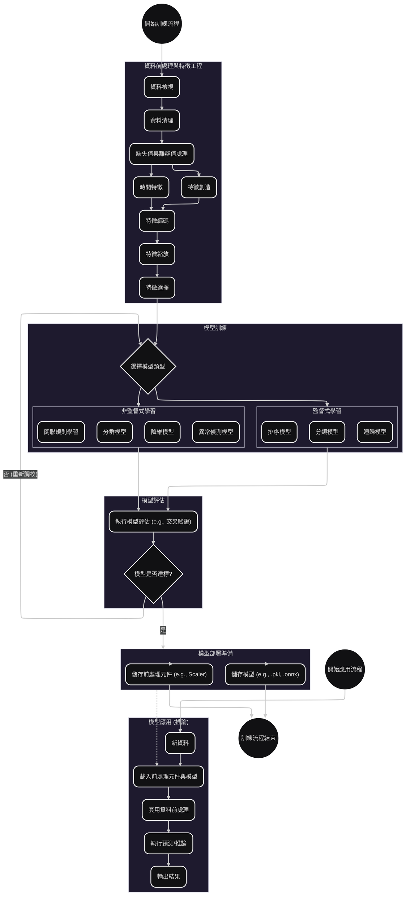

# 機器學習執行流程圖

```mermaid
---
config:
  theme: redux-dark
  layout: elk
---
flowchart TD
 subgraph A["資料前處理與特徵工程"]
    direction LR
        A1("資料清理")
        A0("資料檢視")
        A2("缺失值與離群值處理")
        A3("特徵創造")
        A4("時間特徵")
        A5("特徵編碼")
        A6("特徵縮放")
        A7("特徵選擇")
  end
 subgraph B1["監督式學習"]
    direction LR
        B1_1("分類模型")
        B1_2("迴歸模型")
        B1_3("排序模型")
  end
 subgraph B2["非監督式學習"]
    direction LR
        B2_1("分群模型")
        B2_2("降維模型")
        B2_3("關聯規則學習")
        B2_4("異常偵測模型")
  end
 subgraph B["模型訓練"]
    direction TB
        B0{"選擇模型類型"}
        B1
        B2
  end
 subgraph C["模型評估"]
    direction TB
        C1("執行模型評估 (e.g., 交叉驗證)")
        C2{"模型是否達標?"}
  end
 subgraph D["模型部署準備"]
    direction LR
        D1("儲存模型 (e.g., .pkl, .onnx)")
        D2("儲存前處理元件 (e.g., Scaler)")
  end
 subgraph E["模型應用 (推論)"]
    direction TB
        E0("新資料")
        E1("載入前處理元件與模型")
        E2("套用資料前處理")
        E3("執行預測/推論")
        E4("輸出結果")
  end
    B0 --> B1 & B2
    Start(("開始訓練流程")) --> A0
    A0 --> A1
    A1 --> A2
    A2 --> A3 & A4
    A3 --> A5
    A4 --> A5
    A5 --> A6
    A6 --> A7
    A7 --> B0
    B1 --> C1
    B2 --> C1
    C1 --> C2
    C2 -- 是 --> D
    C2 -- 否 (重新調校) --> B0
    D --> D1 & D2
    D1 --> End_Train(("訓練流程結束"))
    D2 --> End_Train
    Start_Inference(("開始應用流程")) --> E0
    E0 --> E1
    E1 --> E2
    E2 --> E3
    E3 --> E4
    D -.-> E1

```
