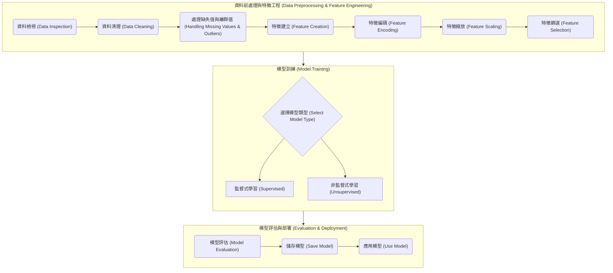

# ML 專案領航員 (ML Project Navigator)

歡迎使用 ML 專案領航員！這是一個透過大型語言模型（LLM）引導您完成機器學習專案的互動式流程。無論您是初學者還是經驗豐富的資料科學家，這個工具都能幫助您有條不紊地探索資料、建立模型並評估結果。

## 核心工作流程

我們的領航員會引導您走過一個標準的機器學習流程，確保您不會錯過任何關鍵步驟。

## 如何開始 (Getting Started)

開始您的旅程非常簡單。請根據您偏好的語言，按照以下指示操作。

### English Guide

1.  **Initial Setup**:
    Upload the `ml-interactive-process-en-US.md` file to your language model.

    Then, send the following prompt to activate the navigator:
    > You are to act as an "ML Project Navigator." Your task is to strictly follow the steps in the "Interactive Process" I have provided to guide me through my machine learning project.

2.  **Upload Your Dataset**:
    For best results, we recommend splitting your dataset into training and testing sets beforehand.

    Upload your data file and simply say:
    > This is my dataset.

    The navigator will then take over and guide you through the process.

### 繁體中文指南

1.  **初始設定**:
    將 `ml-interactive-process-zh-TW.md` 檔案上傳至您的語言模型。

    接著，發送以下提示詞以啟動領航員：
    > 你將扮演「ML專案領航員」的角色。你的任務是嚴格遵循我提供「互動式流程」中的步驟，一步步引導我完成機器學習。

2.  **上傳資料集**:
    為了獲得最佳效果，建議您先將資料集切分為訓練集和測試集。

    上傳您的資料集檔案後，僅需輸入：
    > 這是我的資料集。

    領航員將會接手，並開始引導您。

## 貢獻 (Contributing)

我們歡迎任何形式的貢獻！如果您對改善互動流程或新增功能有任何想法，請隨時提出 Pull Request 或建立 Issue。
