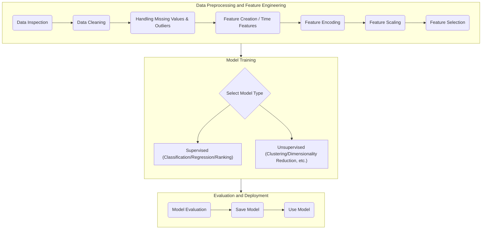

# Overview of the Interactive Machine Learning Process

This document is a Markdown guide to a series of machine learning workflows, designed to provide a quick and clear end-to-end overview of a machine learning project.



---

## 1. Data Inspection

- **Goal**: To perform an initial, comprehensive exploration of the dataset, creating a "health check report."
- **Core Operations**:
    - **Load Data**: Use `pandas.read_csv()` to load the data.
    - **Basic Information**: Use `df.info()` to view column types and non-null counts to quickly identify missing values.
    - **Descriptive Statistics**: Use `df.describe().T` to analyze the distribution, mean, standard deviation, and extreme values of numerical features, providing a preliminary assessment of skewness and outliers.
    - **Visualization**: Use `df.hist()` to plot histograms for an intuitive understanding of data distribution.

```python
import pandas as pd
# Load the data
df = pd.read_csv('YOUR_FILE_PATH')
# View the first five rows
print(df.head())
# View basic information
print(df.info())
# View numerical statistics
print(df.describe().T)
```

---

## 2. Data Cleaning

- **Goal**: To address structural issues in the data and establish a clean, reliable data foundation.
- **Core Operations**:
    - **Duplicate Data**: Check with `df.duplicated().sum()` and remove with `df.drop_duplicates()`.
    - **Column Naming**: Standardize column names using `df.columns.str.lower().str.replace(' ', '_')`.
    - **Data Type Correction**: Correct erroneous data types using `pd.to_numeric` and `pd.to_datetime`. The `errors='coerce'` parameter is very helpful for handling messy data.

---

## 3. Handling Missing Values & Outliers

- **Goal**: To handle the "holes" and "extremists" in the data content.
- **Core Operations**:
    - **Missing Value Diagnosis**: Visualize missing data patterns using the `missingno` package.
    - **Missing Value Imputation**:
        - **Numerical**: Impute with the median using `df[col].fillna(df[col].median())`, which is more robust to outliers.
        - **Categorical**: Impute with the mode using `df[col].fillna(df[col].mode()[0])`.
    - **Outlier Detection**: Visualize with box plots using `sns.boxplot()` and calculate boundaries using the IQR rule.
    - **Outlier Handling**:
        - **Capping**: Replace extreme values with predefined boundary values. This is a recommended robust practice.

---

## 4. Feature Creation

- **Goal**: To extract or combine new features from existing ones that are more predictive for the model.
- **Core Operations**:
    - **Interaction Features**: Manually create features like `df['a_div_b'] = df['a'] / df['b']`, or automatically generate polynomial and interaction terms using `sklearn.preprocessing.PolynomialFeatures`.
    - **Grouped Aggregation**: Create group-based statistical features using `df.groupby('category_col').agg({'numeric_col': ['mean', 'std']})`.
    - **Time-based Features (Optional)**:
        - **Decomposition**: Extract year, month, day, day of the week, is_weekend, etc., from datetime objects.
        - **Lag Features**: Use past values to predict the present, e.g., `df['sales_lag_1'] = df['sales'].shift(1)`.
        - **Rolling Window**: Use statistics from a past period to predict the present, e.g., `df['sales'].rolling(7).mean()`.

---

## 5. Feature Encoding

- **Goal**: To convert categorical features, which models cannot understand, into a numerical format.
- **Core Operations**:
    - **Ordinal Features**: Use `map()` for manual mapping, e.g., `{'Poor':0, 'Average':1, 'Good':2}`.
    - **Nominal Features**: Use `pd.get_dummies(df, drop_first=True)` for one-hot encoding to avoid introducing an artificial order.

---

## 6. Feature Scaling

- **Goal**: To adjust all numerical features to a similar scale, preventing the model from being dominated by features with large values.
- **Core Operations**:
    - **Standardization**: Use `StandardScaler` to transform data to have a mean of 0 and a standard deviation of 1. It's the most common method and is not sensitive to outliers.
    - **Normalization**: Use `MinMaxScaler` to scale data to a [0, 1] range. It is sensitive to outliers.
- **Key Principle**: `fit` the scaler **only on the training set**, then use the same scaler to `transform` **both the training and test sets**.

```python
from sklearn.preprocessing import StandardScaler
scaler = StandardScaler()
X_train_scaled = scaler.fit_transform(X_train)
X_test_scaled = scaler.transform(X_test)
```

---

## 7. Feature Selection

- **Goal**: To select the "golden subset" of the most predictive features from all available features to simplify the model and reduce overfitting.
- **Three Methods**:
    - **Filter Method**: `SelectKBest`, which uses statistical tests for rapid screening but ignores feature interactions.
    - **Wrapper Method**: `RFECV`, which repeatedly trains and evaluates a model. It yields good results but is computationally expensive.
    - **Embedded Method**: `SelectFromModel` used with a model like `RandomForest`. Feature selection is performed during model training, balancing efficiency and effectiveness.

---

## 8. Modeling

### Supervised Learning

- **Data Splitting**: Use `train_test_split` to divide data into training and testing sets. Using `stratify=y` is important for classification problems.
- **Classification**: Predicts a category.
    - **Models**: `LogisticRegression`, `DecisionTreeClassifier`, `RandomForestClassifier`.
    - **Evaluation**: `accuracy_score`.
- **Regression**: Predicts a continuous value.
    - **Models**: `LinearRegression`, `RandomForestRegressor`, `GradientBoostingRegressor`.
    - **Evaluation**: `mean_absolute_error` (MAE), `mean_squared_error` (RMSE), `r2_score` (R²).
- **Learning to Rank**: Predicts the order of a list.
    - **Model**: `lightgbm.LGBMRanker`.
    - **Evaluation**: `ndcg_score`.

### Unsupervised Learning

- **Clustering**: Automatically groups data.
    - **Models**: `KMeans` (centroid-based), `DBSCAN` (density-based), `AgglomerativeClustering` (hierarchical).
- **Dimensionality Reduction**: Reduces the number of features.
    - **Models**: `PCA` (linear), `t-SNE` (non-linear, for visualization), `UMAP` (modern and efficient).
- **Association Rules**: Discovers relationships like "beer and diapers."
    - **Tools**: `mlxtend.apriori`, `mlxtend.association_rules`.
- **Anomaly Detection**: Finds points that are "different from the rest."
    - **Models**: `IsolationForest` (efficient first choice), `LocalOutlierFactor` (local density-based), `OneClassSVM` (boundary-based).

---

## 9. Model Evaluation

- **Goal**: To comprehensively and objectively measure model performance.
- **Core Tools**:
    - **Classification**:
        - `confusion_matrix`: The foundation of evaluation.
        - `classification_report`: Provides precision, recall, and F1-score.
        - `roc_curve`, `auc`: ROC curve and AUC score, which measure the model's ability to distinguish between classes.
    - **Regression**:
        - **Residual Plot**: `y_test - y_pred`. Ideally, residuals should be randomly distributed around 0.
    - **General**:
        - **Cross-Validation**: `cross_val_score` for more robust performance evaluation.
        - **Hyperparameter Tuning**: `GridSearchCV` to automatically find the best combination of model parameters.

---

## 10. Saving & Using the Model

- **Goal**: To achieve "train once, use multiple times."
- **Core Operations**:
    - **Saving**: Use `joblib.dump()` to save the trained `model` and preprocessing components (like the `scaler`).
    - **Loading and Using**:
        1. Use `joblib.load()` to load the `model` and `scaler`.
        2. **Golden Rule**: New data must undergo the **exact same preprocessing steps** (encoding, scaling, etc.) as the training data.
        3. Feed the processed data into `model.predict()` to get the results.

```python
import joblib
# Save the model
joblib.dump(model, 'final_model.joblib')
joblib.dump(scaler, 'scaler.joblib')

# Load the model
loaded_model = joblib.load('final_model.joblib')
loaded_scaler = joblib.load('scaler.joblib')

# Use the model
new_data_scaled = loaded_scaler.transform(new_data_processed)
prediction = loaded_model.predict(new_data_scaled)
```
