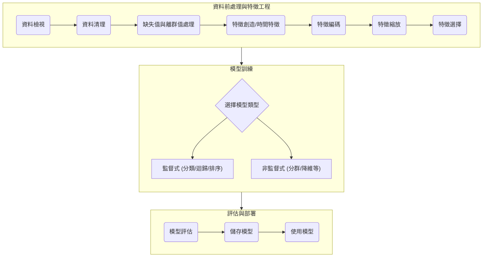

# 機器學習互動式流程總覽

這份文件是將一系列機器學習流程的 Markdown 文件，旨在提供一個快速、清晰的端到端機器學習專案導覽。



---

## 1. 資料檢視 (Data Inspection)

- **目標**: 對資料集進行首次的全面探索，完成一份「體檢報告」。
- **核心操作**:
    - **載入資料**: 使用 `pandas.read_csv()` 載入資料。
    - **基礎資訊**: 使用 `df.info()` 查看欄位型態、非空值數量，快速識別缺失值。
    - **敘述性統計**: 使用 `df.describe().T` 分析數值特徵的分佈、均值、標準差和極值，初步判斷偏態和離群值。
    - **視覺化**: 使用 `df.hist()` 繪製直方圖，直觀感受數據分佈。

```python
import pandas as pd
# 載入資料
df = pd.read_csv('YOUR_FILE_PATH')
# 查看前五行
print(df.head())
# 查看基本資訊
print(df.info())
# 查看數值統計
print(df.describe().T)
```

---

## 2. 資料清理 (Data Cleaning)

- **目標**: 處理資料中的結構性問題，建立一個乾淨、可靠的資料基礎。
- **核心操作**:
    - **重複資料**: 使用 `df.duplicated().sum()` 檢查並用 `df.drop_duplicates()` 移除。
    - **欄位命名**: 使用 `df.columns.str.lower().str.replace(' ', '_')` 將欄位名標準化。
    - **資料型態修正**: 使用 `pd.to_numeric` 和 `pd.to_datetime` 修正錯誤的資料型態，`errors='coerce'` 是處理髒數據的好幫手。

---

## 3. 缺失值與離群值處理 (Missing Values & Outliers)

- **目標**: 處理資料內容的「洞」與「極端份子」。
- **核心操作**:
    - **缺失值診斷**: 使用 `missingno` 套件視覺化缺失模式。
    - **缺失值填補**:
        - **數值型**: 用中位數 `df[col].fillna(df[col].median())` 填補，對離群值更穩健。
        - **類別型**: 用眾數 `df[col].fillna(df[col].mode()[0])` 填補。
    - **離群值偵測**: 使用箱型圖 `sns.boxplot()` 視覺化，並用 IQR 法則計算邊界。
    - **離群值處理**:
        - **縮尾 (Capping)**: 將極端值替換為預設的邊界值，是推薦的穩健作法。

---

## 4. 特徵創造 (Feature Creation)

- **目標**: 從現有特徵中提煉或組合出對模型預測更有幫助的新特徵。
- **核心操作**:
    - **交互特徵**: 手動創造如 `df['a_div_b'] = df['a'] / df['b']`，或使用 `sklearn.preprocessing.PolynomialFeatures` 自動生成多項式及交互項。
    - **分組聚合**: 使用 `df.groupby('category_col').agg({'numeric_col': ['mean', 'std']})` 創造群體統計特徵。
    - **時間特徵 (選修)**:
        - **分解**: 從日期時間中提取年、月、日、星期、是否週末等。
        - **滯後 (Lag)**: `df['sales_lag_1'] = df['sales'].shift(1)`，用過去的值預測現在。
        - **滑動窗口 (Rolling)**: `df['sales'].rolling(7).mean()`，用過去一段時間的統計值預測現在。

---

## 5. 特徵編碼 (Feature Encoding)

- **目標**: 將模型無法理解的類別型特徵，翻譯成數值格式。
- **核心操作**:
    - **有序 (Ordinal) 特徵**: 使用 `map()` 進行手動映射，如 `{'差':0, '中':1, '好':2}`。
    - **無序 (Nominal) 特徵**: 使用 `pd.get_dummies(df, drop_first=True)` 進行獨熱編碼，避免引入不存在的順序關係。

---

## 6. 特徵縮放 (Feature Scaling)

- **目標**: 將所有數值特徵調整到相似的尺度，避免模型被大數值特徵主導。
- **核心操作**:
    - **標準化 (Standardization)**: `StandardScaler`，轉換為均值為0，標準差為1的分佈。最常用，對離群值不敏感。
    - **歸一化 (Normalization)**: `MinMaxScaler`，縮放到 [0, 1] 區間。對離群值敏感。
- **關鍵原則**: 只在**訓練集**上 `fit` 縮放器，然後用同一個縮放器 `transform` **訓練集和測試集**。

```python
from sklearn.preprocessing import StandardScaler
scaler = StandardScaler()
X_train_scaled = scaler.fit_transform(X_train)
X_test_scaled = scaler.transform(X_test)
```

---

## 7. 特徵選擇 (Feature Selection)

- **目標**: 從所有特徵中篩選出最具預測能力的「黃金子集」，以簡化模型、降低過擬合。
- **三種方法**:
    - **過濾法 (Filter)**: `SelectKBest`，基於統計檢驗快速篩選，忽略特徵交互。
    - **包裹法 (Wrapper)**: `RFECV`，用模型反覆訓練評估，效果好但成本高。
    - **嵌入法 (Embedded)**: `SelectFromModel` 搭配 `RandomForest`，在模型訓練中完成選擇，是效率與效果的平衡。

---

## 8. 模型訓練 (Modeling)

### 監督式學習

- **切分資料**: 使用 `train_test_split` 將資料分為訓練集和測試集，`stratify=y` 對分類問題很重要。
- **分類 (Classification)**: 預測類別。
    - **模型**: `LogisticRegression`, `DecisionTreeClassifier`, `RandomForestClassifier`。
    - **評估**: `accuracy_score`。
- **迴歸 (Regression)**: 預測連續數值。
    - **模型**: `LinearRegression`, `RandomForestRegressor`, `GradientBoostingRegressor`。
    - **評估**: `mean_absolute_error` (MAE), `mean_squared_error` (RMSE), `r2_score` (R²)。
- **學習排序 (Learning to Rank)**: 預測列表順序。
    - **模型**: `lightgbm.LGBMRanker`。
    - **評估**: `ndcg_score`。

### 非監督式學習

- **分群 (Clustering)**: 自動將數據分組。
    - **模型**: `KMeans` (基於中心), `DBSCAN` (基於密度), `AgglomerativeClustering` (階層式)。
- **降維 (Dimensionality Reduction)**: 減少特徵數量。
    - **模型**: `PCA` (線性), `t-SNE` (非線性, 視覺化), `UMAP` (現代高效)。
- **關聯規則 (Association Rules)**: 發現「啤酒與尿布」的關係。
    - **工具**: `mlxtend.apriori`, `mlxtend.association_rules`。
- **異常偵測 (Anomaly Detection)**: 找出「與眾不同」的點。
    - **模型**: `IsolationForest` (高效首選), `LocalOutlierFactor` (基於局部密度), `OneClassSVM` (基於邊界)。

---

## 9. 模型評估 (Model Evaluation)

- **目標**: 全面、客觀地衡量模型性能。
- **核心工具**:
    - **分類**:
        - `confusion_matrix`: 混淆矩陣，評估的基礎。
        - `classification_report`: 提供精確率(Precision)、召回率(Recall)、F1-Score。
        - `roc_curve`, `auc`: ROC曲線和AUC值，衡量模型的區分能力。
    - **迴歸**:
        - **殘差圖**: `y_test - y_pred`，理想情況下應隨機分佈在0附近。
    - **通用**:
        - **交叉驗證 (Cross-Validation)**: `cross_val_score`，更穩健的性能評估。
        - **超參數調優**: `GridSearchCV`，自動尋找最佳模型參數組合。

---

## 10. 儲存與使用模型 (Saving & Using)

- **目標**: 實現「一次訓練，多次使用」。
- **核心操作**:
    - **儲存**: 使用 `joblib.dump()` 保存訓練好的 `model` 和預處理元件 (如 `scaler`)。
    - **載入與使用**:
        1. 使用 `joblib.load()` 載入 `model` 和 `scaler`。
        2. **黃金準則**: 新數據必須經過**與訓練時完全相同**的預處理步驟 (編碼、縮放等)。
        3. 將處理好的數據送入 `model.predict()` 得到結果。

```python
import joblib
# 儲存
joblib.dump(model, 'final_model.joblib')
joblib.dump(scaler, 'scaler.joblib')

# 載入
loaded_model = joblib.load('final_model.joblib')
loaded_scaler = joblib.load('scaler.joblib')

# 使用
new_data_scaled = loaded_scaler.transform(new_data_processed)
prediction = loaded_model.predict(new_data_scaled)
```
