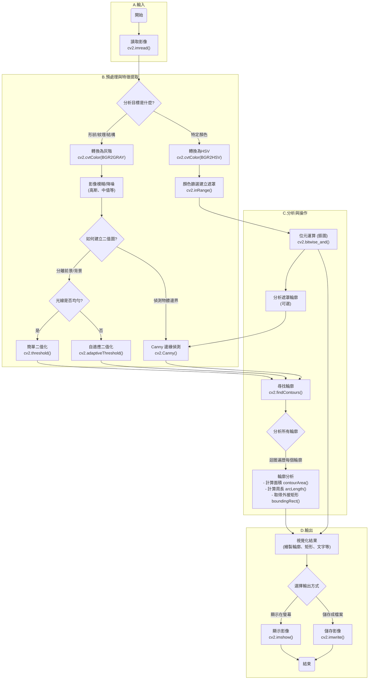

```mermaid
graph TD
    %% --- 1.開始與輸入 ---
    A(開始) --> B["讀取影像<br/>cv2.imread()"];

    %% --- 2.預處理路徑選擇 ---
    B --> C{分析目標是什麼?};
    C -- 形狀/紋理/結構 --> D["轉換為灰階<br/>cv2.cvtColor(BGR2GRAY)"];
    C -- 特定顏色 --> E["轉換為HSV<br/>cv2.cvtColor(BGR2HSV)"];

    %% --- 3.基於顏色的處理路徑 ---
    E --> F["顏色篩選建立遮罩<br/>cv2.inRange()"];
    F --> G["位元運算 (摳圖)<br/>cv2.bitwise_and()"];
    G --> H["分析遮罩輪廓<br/>(可選)"];
    H --> K;


    %% --- 4.基於形狀的處理路徑 ---
    D --> I["影像模糊/降噪<br/>(高斯、中值等)"];
    I --> J{如何建立二值圖?};
    J -- 偵測物體邊界 --> K["Canny 邊緣偵測<br/>cv2.Canny()"];
    J -- 分離前景/背景 --> L{光線是否均勻?};
    L -- 是 --> M["簡單二值化<br/>cv2.threshold()"];
    L -- 否 --> N["自適應二值化<br/>cv2.adaptiveThreshold()"];

    %% --- 5.核心分析：輪廓 ---
    M --> O["尋找輪廓<br/>cv2.findContours()"];
    N --> O;
    K --> O;

    O --> P{分析所有輪廓};
    P -- 迴圈遍歷每個輪廓 --> Q["輪廓分析<br/>- 計算面積 contourArea()<br/>- 計算周長 arcLength()<br/>- 取得外接矩形 boundingRect()"];

    %% --- 6. 輸出與結束 ---
    Q --> R["視覺化結果<br/>(繪製輪廓、矩形、文字等)"];
    G --> R;
    %% 摳圖結果也可以直接視覺化
    R --> S{選擇輸出方式};
    S -- 顯示在螢幕 --> T["顯示影像<br/>cv2.imshow()"];
    S -- 儲存成檔案 --> U["儲存影像<br/>cv2.imwrite()"];
    T --> V(結束);
    U --> V;

    subgraph "A.輸入"
        A
        B
    end

    subgraph "B.預處理與特徵提取"
        C
        D
        E
        F
        I
        J
        K
        L
        M
        N
    end

    subgraph "C.分析與操作"
        G
        H
        O
        P
        Q
    end

    subgraph "D.輸出"
        R
        S
        T
        U
        V
    end
```
