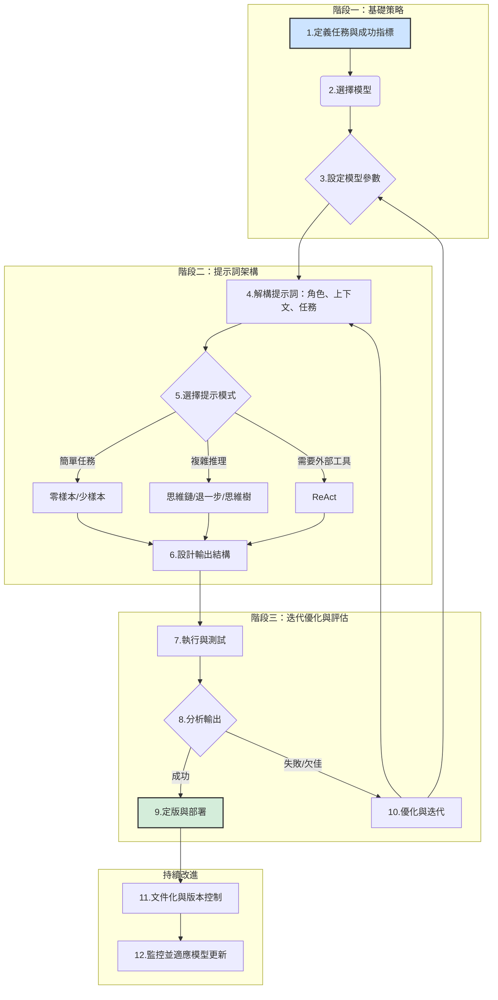

## 提示工程生命週期：實現最佳 LLM 效能的系統化工作流程

### 引言：從「藝術」到「工程」的思維轉變

撰寫提示詞（Prompt）看似簡單，但要穩定、準確地引導大型語言模型（LLM）產出預期結果，實則是一項複雜的挑戰。提示詞的效能受模型選擇、參數設定、用字遣詞、結構設計等多重因素影響。不佳的提示詞會導致模型回應模稜兩可，限制其應用價值。

因此，我們必須將提示詞的創建，從依賴直覺和反覆試錯的「藝術」，轉變為一門有系統、可重複、可測量的「工程學科」。這需要一個結構化的迭代流程，而非漫無目的的猜測。

本報告圍繞一個核心框架——**提示工程生命週期（The Prompt Engineering Lifecycle）**——來闡述此流程。它並非線性步驟，而是一個持續改進的循環系統，指導從業人員從策略規劃到部署維護的完整過程。

> **核心心智模型**：我們的目標不是一次性「寫對提示詞」，而是「建立一個能隨時間推移，持續改進提示詞的系統」。這正是工程學科的基礎。

-----

### 階段一：基礎策略與範疇界定

在撰寫提示詞內容前，奠定策略基礎至關重要。此階段的失誤將影響後續所有環節。

#### 1.1 定義任務與成功指標

將模糊的業務需求，轉化為清晰、具體且可衡量的目標。

  * **模糊指令**：`幫我摘要這份文件。`
  * **具體指令**：`為一名高中生摘要這份法律文件，聚焦於關鍵的義務和截止日期，並將字數控制在 200 字以內。`

明確定義「好的」輸出標準（是事實準確性、特定語氣還是固定結構？）能為模型提供清晰的預測方向，大幅提高成功率。

#### 1.2 模型選擇

提示詞的表現與所選模型高度相關。為 `gemini-pro` 優化的提示詞，在 `GPT` 或 `Claude` 上可能需要調整。選擇模型的考量因素包括：

  * **任務複雜度**：簡單任務可用較小模型；複雜推理需更強大的模型。
  * **成本**：不同模型的 API 成本差異巨大。
  * **延遲需求**：即時應用對反應時間有嚴格要求。
  * **模型特長**：某些模型擅長程式碼，另一些則擅長創意寫作。

#### 1.3 策略性參數調校

LLM 的行為受一系列可配置參數控制，它們如同模型的「旋鈕」。

  * **溫度 (Temperature)**：控制輸出的隨機性。低溫（如 `0.1`）產生更確定、符合事實的回答；高溫（如 `0.9`）則產生更多樣、更具創意的結果。
  * **Top-K 與 Top-P (核取樣)**：限制模型預測下一個詞元的選擇範圍，與溫度協同作用，控制輸出的隨機性。
  * **輸出長度 (Output Length)**：管理最大輸出詞元數，影響成本、延遲，並能防止因截斷而產生不完整的無效回應。

> **關鍵觀念：平衡的藝術**
> 這些參數並非獨立，而是相互關聯的系統。目標是找到一組參數**組合**，以達到期望的確定性與創造性之間的平衡，而非一次只調整一個參數。非預期的輸出很可能源於參數間的意外交互作用。

**表 1：模型參數調校指南**
| 任務類別 | 建議溫度 (Temperature) | 建議 Top-P | 原理說明 |
| :--- | :--- | :--- | :--- |
| 事實問答／資訊提取 | `0.0` - `0.2` | `0.9` - `0.95` | 優先考慮確定性和準確性，期望有唯一的正確答案。 |
| 創意寫作／腦力激盪 | `0.7` - `1.0` | `0.99` | 鼓勵多樣性、新穎性和意想不到的聯想。 |
| 程式碼生成 | `0.1` - `0.3` | `0.95` | 在確保語法正確性的基礎上，提供一定的實現靈活性。 |
| 分類／摘要 | `0.1` - `0.2` | `0.95` | 需要保持一致性和事實性，同時具備自然的語言流暢度。 |

-----

### 階段二：高效提示詞的架構設計

此階段專注於提示詞本身的撰寫工藝，建立模組化的思維有助於系統性地提升品質。

#### 2.1 提示詞的核心組成要素

一個結構完整的提示詞通常包含以下部分：

1.  **角色 (Persona / Role)**：為模型指定身份（`扮演一名資深的軟體架構師`），以設定其語氣、風格和知識基礎。
2.  **上下文 (Context)**：提供完成任務所必需的背景資訊（`你正在為一個關於 80 年代復古大型電玩遊戲的部落格撰寫文章`）。
3.  **指令/任務 (Instruction / Task)**：明確的、由動詞驅動的命令（`生成`、`分類`、`摘要`）。
4.  **範例 (Examples / Few-Shot)**：提供一或多個輸入-輸出範例，向模型展示期望的格式或模式。
5.  **輸出結構 (Output Structure)**：明確定義期望的輸出格式（`JSON`、`Markdown`、`編號列表`），這不僅利於後續處理，也能約束模型，提升回應穩定性。

#### 2.2 選擇合適的提示模式

根據任務性質選擇最合適的技巧，避免對簡單任務過度設計，或對複雜任務使用無效方法。

**表 2：提示模式選擇矩陣**
| 任務類型 | 描述 | 主要技巧 |
| :--- | :--- | :--- |
| **簡單分類** | 從預定義的標籤集合中指派一個標籤。 | **少樣本 (Few-Shot)** |
| **資訊提取** | 從文本中抓取特定的資料點。 | **帶有 JSON 輸出的少樣本** |
| **複雜推理** | 多步驟的邏輯或數學問題。 | **思維鏈 (Chain of Thought, CoT)** |
| **穩健推理** | 準確性至關重要的高風險推理任務。 | **自洽性 (Self-Consistency)** |
| **開放式探索** | 具有多種可能解決路徑的問題（如遊戲策略）。 | **思維樹 (Tree of Thoughts, ToT)** |
| **抽象問答** | 回答需要歸納和泛化能力的問題。 | **退一步提示 (Step-Back Prompting)** |
| **互動式任務** | 需要使用外部資訊或工具（如網路搜尋）。 | **ReAct** |

#### 2.3 透過結構化資料（JSON）強化輸出可靠性

要求模型以特定 JSON 結構回傳，不僅是為了格式，更是一種強而有力的**約束**。這迫使模型去識別並填寫指定欄位，從而減少產生幻覺或偏離主題的可能性。

> **從「對話」到「合約」的轉變**
> 將結構化資料（如 JSON Schema）應用於輸入和輸出，從根本上改變了與 LLM 的互動模式。它不再是開放式的對話請求，而更像是一份正式的「資料合約」。這種轉變對於建構可靠、生產級別的應用至關重要，因為它使 LLM 的行為更可預測。

-----

### 階段三：迭代優化與評估的循環

此階段體現了提示工程的核心精神：它是一門實驗科學。

#### 3.1 測試-分析-優化循環

這是整個工作流程的心臟，其步驟如下：

1.  **執行 (Test)**：運行提示詞並收集輸出。
2.  **分析 (Analyze)**：將輸出與成功指標比對，找出常見失敗模式（如事實不準確、指令遵循失敗、重複迴圈等）。
3.  **優化 (Refine)**：根據分析調整提示詞或模型參數，然後重新執行。

優化策略包括：使用正面指令（`請這樣做`）而非負面約束（`不要那樣做`），簡化提示詞，以及改進少樣本範例。

#### 3.2 系統化文件記錄

這是最關鍵卻也最易被忽視的實踐。沒有文件記錄，「迭代」就只是隨機修補。詳盡的記錄對於除錯、團隊協作及建立組織知識庫至關重要。

**表 3：提示詞迭代日誌範本**
| 欄位 | 描述 | 範例 |
| :--- | :--- | :--- |
| **提示詞 ID** | 唯一的識別碼。 | `classify_email_v3.2` |
| **目標** | 此次嘗試的一句話目標。 | 測試加入 CoT 步驟是否能提升對諷刺郵件的分類準確性。 |
| **模型** | 模型名稱與版本。 | `gemini-pro@001` |
| **參數** | 溫度、Top-P/K、最大詞元數等。 | `T=0.1`, `P=0.95`, `Max=256` |
| **完整提示詞** | 使用的完整、精確的提示詞內容。 | `[貼上完整提示詞]` |
| **輸出結果** | 模型的逐字輸出。 | `[貼上完整輸出]` |
| **評估結果** | 客觀/主觀的結果（成功/失敗）。 | 失敗 |
| **分析與下一步** | 成功或失敗的原因，以及後續計畫。 | 未能識別諷刺語氣。下一步將新增一個諷刺郵件的少樣本範例。 |

#### 3.3 進階迭代：代理系統與自動化工程

當手動迭代達到瓶頸時，可探索更進階的方法：

  * **ReAct (Reason and Act)**：賦予 LLM 使用外部工具（如搜尋引擎）的能力。模型首先「推理」需要何種資訊，然後生成「行動」指令調用工具，形成「推理-行動」的循環，這是建構 LLM 代理（Agent）的基礎。
  * **APE (Automatic Prompt Engineering)**：利用一個 LLM 為另一個 LLM 生成並評估大量的候選提示詞，從中挑選效果最佳的一個，實現提示詞設計的自動化。

-----

### 結論：實現卓越提示工程的五大原則

要從隨性的使用者轉變為專業的提示工程師，掌握以下原則至關重要：

1.  **系統化思維**：遵循結構化流程，而非隨機修補。將提示工程視為一門嚴謹的學科。
2.  **極致的明確性**：在指令、上下文、範例和輸出格式上，務求清晰、具體、無歧義。
3.  **擁抱實驗精神**：將每次調整都視為科學實驗。系統地測試、深入地分析、有根據地優化。
4.  **成為文件記錄的擁護者**：迭代日誌是長期成功的最寶貴資產，是團隊知識共享和能力沉澱的基礎。
5.  **保持適應性**：LLM 正在高速發展。持續監控模型演進，並隨之調整策略，是保持競爭力的關鍵。

最終，掌握這個生命週期，意味著您能夠超越簡單的「提問」，進而真正地「設計」與大型語言模型的互動。這正是專業提示工程的精髓所在。
