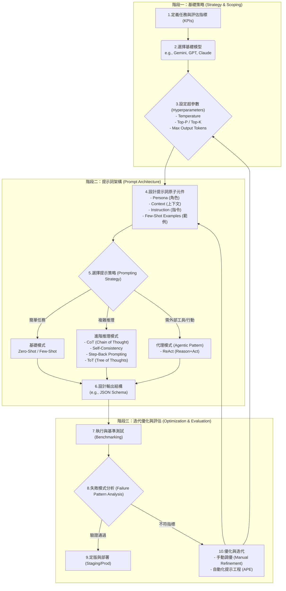

```mermaid
graph TD
    subgraph "階段一：基礎策略 (Strategy & Scoping)"
        A["1.定義任務與評估指標 (KPIs)"] --> B("2.選擇基礎模型<br/>e.g., Gemini, GPT, Claude");
        B --> C{"3.設定超參數 (Hyperparameters)<br/>- Temperature<br/>- Top-P / Top-K<br/>- Max Output Tokens"};
    end

    subgraph "階段二：提示詞架構 (Prompt Architecture)"
        C --> D["4.設計提示詞原子元件<br/>- Persona (角色)<br/>- Context (上下文)<br/>- Instruction (指令)<br/>- Few-Shot Examples (範例)"];
        D --> E{"5.選擇提示策略 (Prompting Strategy)"};
        E -- 簡單任務 --> F[基礎模式<br/>Zero-Shot / Few-Shot];
        E -- 複雜推理 --> G["進階推理模式<br/>- CoT (Chain of Thought)<br/>- Self-Consistency<br/>- Step-Back Prompting<br/>- ToT (Tree of Thoughts)"];
        E -- 需外部工具/行動 --> H["代理模式 (Agentic Pattern)<br/>- ReAct (Reason+Act)"];
        F --> I["6.設計輸出結構<br/>(e.g., JSON Schema)"];
        G --> I;
        H --> I;
    end

    subgraph "階段三：迭代優化與評估 (Optimization & Evaluation)"
        I --> J["7.執行與基準測試 (Benchmarking)"];
        J --> K{"8.失敗模式分析 (Failure Pattern Analysis)"};
        K -- 驗證通過 --> L["9.定版與部署 (Staging/Prod)"];
        K -- 不符指標 --> M["10.優化與迭代<br/>- 手動調優 (Manual Refinement)<br/>- 自動化提示工程 (APE)"];
        M --> D;
        M --> C;
    end
```
