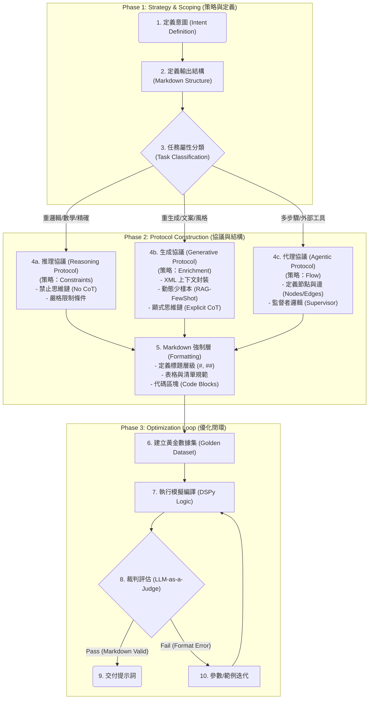

```mermaid
graph TD
    %% 階段一：策略與定義
    subgraph "Phase 1: Strategy & Scoping (策略與定義)"
        A("1. 定義意圖 (Intent Definition)") --> B["2. 定義輸出結構<br/>(Markdown Structure)"];
        B --> C{"3. 任務屬性分類<br/>(Task Classification)"};
    end

    %% 階段二：協議與結構構建 (根據屬性分流)
    subgraph "Phase 2: Protocol Construction (協議與結構)"
        C -- "重邏輯/數學/精確" --> D["4a. 推理協議 (Reasoning Protocol)<br/>(策略：Constraints)<br/>- 禁止思維鏈 (No CoT)<br/>- 嚴格限制條件"];

        C -- "重生成/文案/風格" --> E["4b. 生成協議 (Generative Protocol)<br/>(策略：Enrichment)<br/>- XML 上下文封裝<br/>- 動態少樣本 (RAG-FewShot)<br/>- 顯式思維鏈 (Explicit CoT)"];

        C -- "多步驟/外部工具" --> F["4c. 代理協議 (Agentic Protocol)<br/>(策略：Flow)<br/>- 定義節點與邊 (Nodes/Edges)<br/>- 監督者邏輯 (Supervisor)"];

        D --> G["5. Markdown 強制層 (Formatting)<br/>- 定義標題層級 (#, ##)<br/>- 表格與清單規範<br/>- 代碼區塊 (Code Blocks)"];
        E --> G;
        F --> G;
    end

    %% 階段三：評估閉環
    subgraph "Phase 3: Optimization Loop (優化閉環)"
        G --> H["6. 建立黃金數據集 (Golden Dataset)"];
        H --> I["7. 執行模擬編譯 (DSPy Logic)"];
        I --> J{"8. 裁判評估 (LLM-as-a-Judge)"};
        J -- "Pass (Markdown Valid)" --> K("9. 交付提示詞");
        J -- "Fail (Format Error)" --> L["10. 參數/範例迭代"];
        L --> I;
    end
```
